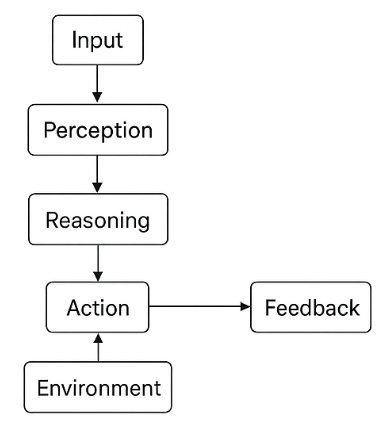
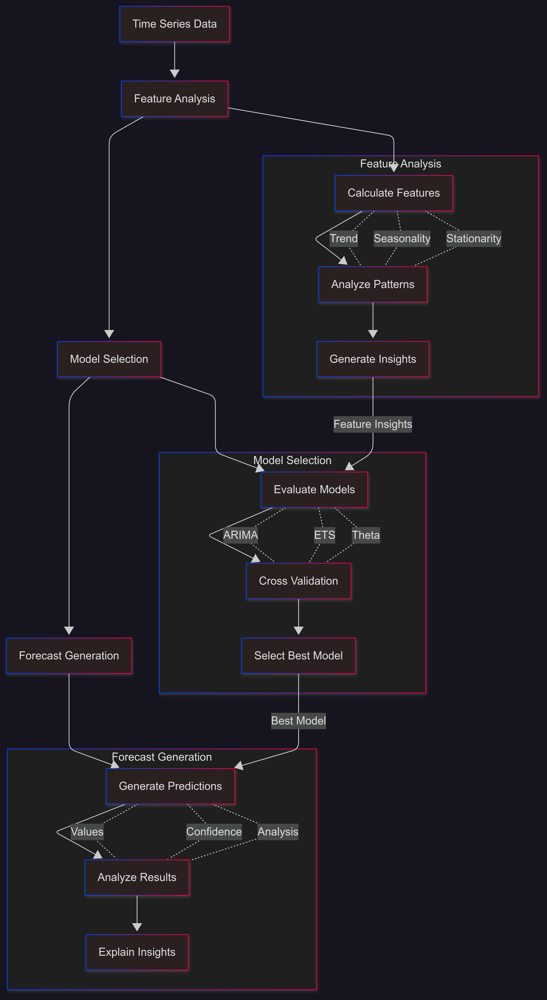

```{r setup, include=FALSE}
knitr::opts_chunk$set(echo = TRUE)
knitr::opts_chunk$set(message = FALSE)
source("../../src/R/utils.R")
library(tidyverse)
```


# Introduction

The rapid evolution of Large Language Models (LLMs) has reshaped the landscape of artificial intelligence. Beyond their ability to generate text and reason over language, these models are increasingly being integrated into agentic systems — autonomous entities capable of perceiving, reasoning, acting, and learning in complex environments.
These LLM Agents mark a shift from static AI models that merely respond to prompts, toward dynamic systems that can plan actions, use tools, and interact with the world to achieve specific goals.


## Agents and Foundation Models

An agent is a system that can sense its environment, make decisions, and take actions to maximize the likelihood of achieving its objectives. Traditional AI agents often relied on explicit rules, search algorithms, or reinforcement learning.

The integration of Large Language Models has transformed this paradigm. LLMs provide powerful reasoning, planning, and communication abilities, allowing agents to:

- interpret natural language instructions,  
- decompose complex tasks into sequences of actions,  
- invoke external tools or APIs,  
- analyze intermediate results,  
- iteratively refine their behavior through feedback.  

In this setting, the LLM acts as the cognitive core of the agent — guiding decisions, managing context, and maintaining dialogue with users or other systems. Agents built on LLMs can thus operate across diverse domains such as data analysis, coding, scientific research, operations management, and creative industries.


## Potential advantages

The emergence of LLM Agents introduces several important advantages and opportunities:

- Autonomy and Adaptability: LLM Agents can perform multi-step tasks without constant supervision, adapting dynamically to new information, errors, or changing objectives.  

- Natural Interaction: Through natural language communication, agents become more intuitive interfaces between humans and digital systems, reducing the need for specialized technical knowledge.  

- Tool Integration and Reasoning: Agents can combine linguistic reasoning with external tools — such as search engines, databases, APIs, or simulation environments — to complete complex workflows that were previously out of reach for language models alone.  

- Scalability and Efficiency: Once designed, LLM Agents can replicate cognitive workflows across domains, executing large-scale tasks in parallel and supporting human decision-making at scale.  

- Continuous Improvement: With mechanisms for memory, feedback, and learning, LLM Agents can evolve over time, refining their strategies and improving their performance with experience.  


## Conceptual Architecture of LLM Agents

LLM Agents combine the reasoning capabilities of Large Language Models with structured components that enable perception, memory, planning, and action.  
While the exact implementation varies across frameworks (e.g., LangChain, AutoGen, CrewAI, OpenAI’s API agents), most share a similar architecture composed of the following core modules:

### 1. Perception Layer
Responsible for **understanding inputs** from the environment — such as text, images, or sensor data.  
- Converts raw input into structured context.  
- Passes relevant information to the reasoning module.

### 2. Reasoning and Planning (LLM Core)
At the heart of the agent lies the **Large Language Model**, acting as its cognitive engine.  
- Interprets goals, plans actions, and makes decisions.  
- Decomposes complex objectives into smaller steps.  
- Generates and evaluates possible action plans.  

### 3. Tool Use and Action Execution
Agents are **tool-augmented**, meaning they can interact with external systems to perform real-world actions.  
Examples include APIs, databases, code interpreters, or web interfaces.

### 4. Memory
Memory allows agents to **store and recall** information.  
- **Short-term memory:** Keeps recent context for reasoning.  
- **Long-term memory:** Retains facts and past experiences.  
- **Episodic memory:** Records actions and outcomes for self-improvement.

### 5. Feedback and Reflection
The agent continuously **evaluates** its own outputs and actions.  
- Learns from user feedback or system responses.  
- Refines reasoning and strategies for future tasks.

### 6. Environment
Represents the digital or physical space in which the agent operates (e.g., file systems, APIs, robotic interfaces).  
The environment provides feedback and context for subsequent actions.




### Summary

In essence, an **LLM Agent** can be viewed as a loop: **Perceive → Reason → Act → Reflect → Learn**  

This architecture enables agents not only to follow instructions but also to **autonomously plan, adapt, and collaborate**.  
As these systems evolve, they are expected to play an increasingly central role in digital automation, decision support, and human–AI interaction — forming the foundation for the next generation of intelligent, interactive systems.


# Time Series Forecasting Agents

Time series analysis and forecasting agents represent a natural evolution of predictive analytics in the era of LLM-driven autonomy. These agents combine traditional forecasting models with the reasoning, planning, and tool-use capabilities of large language models. Rather than following fixed scripts, they can dynamically explore datasets, detect anomalies, select appropriate models, tune hyperparameters, evaluate performance, and interpret results — all through autonomous decision-making and natural language reasoning. By integrating domain knowledge, historical context, and user intent, forecasting agents can act as intelligent assistants that manage the entire forecasting pipeline: from data ingestion and preprocessing to model selection, retraining, and reporting. Ultimately, they promise to make forecasting systems more adaptive, interpretable, and accessible, enabling continuous improvement and collaboration between human experts and AI systems.  


## TimeCopilot

TimeCopilot is an open-source forecasting agent that combines the power of large language models with state-of-the-art time series foundation models (Amazon Chronos, Salesforce Moirai, Google TimesFM, Nixtla TimeGPT, etc.). It automates and explains complex forecasting workflows, making time series analysis more accessible while maintaining professional-grade accuracy.

### How It Works? 

TimeCopilot is a generative agent that applies a systematic forecasting approach using large language models (LLMs) to:

- Interpret statistical features and patterns  
- Guide model selection based on data characteristics  
- Explain technical decisions in natural language  
- Answer domain-specific questions about forecasts  

Here is an schematic of TimeCopilot's architecture:  



The typical output of TimeCopilot includes:  

- tsfeatures_results: List of calculated time series features  
- tsfeatures_analysis: Natural language analysis of the features  
- selected_model: The best performing model chosen  
- model_details: Technical details about the selected model  
- cross_validation_results: Performance comparison of different models  
- model_comparison: Analysis of why certain models performed better/worse  
- is_better_than_seasonal_naive: Boolean indicating if model beats baseline  
- reason_for_selection: Explanation for model choice  
- forecast: List of future predictions with dates  
- forecast_analysis: Interpretation of the forecast results  
- user_query_response: Response to the user prompt, if any.  

### Unified API for Forecasting Models

TimeCopilot provides a unified API for time series forecasting, integrating foundation models, classical statistical models, machine learning, and neural network families of models. This approach lets you experiment, benchmark, and deploy a wide range of forecasting models with minimal code changes, so you can choose the best tool for your data and use case.

TimeCopilot provides a unified interface to state-of-the-art foundation models for time series forecasting. These models are designed to handle a wide range of forecasting tasks, from classical seasonal patterns to complex, high-dimensional data. Below you will find a list of all available foundation models, each with a dedicated section describing its API and usage.

- Chronos   
- FlowState   
- Moirai  
- Sundial  
- TabPFN  
- TiRex  
- TimeGPT  
- TimesFM  
- Toto  

TimeCopilot includes a suite of classical and statistical forecasting models, providing robust baselines and interpretable alternatives to foundation models. These models are ideal for quick benchmarking, transparent forecasting, and scenarios where simplicity and speed are paramount. TimeCopilot integrates also the popular Prophet model for time series forecasting, developed by Facebook. Prophet is well-suited for business time series with strong seasonal effects and several seasons of historical data.

- ADIDA  
- AutoARIMA  
- AutoCES  
- AutoETS  
- CrostonClassic  
- DynamicOptimizedTheta  
- HistoricAverage  
- IMAPA  
- SeasonalNaive  
- Theta  
- ZeroModel  
- Prophet

TimeCopilot provides access to automated machine learning models for time series forecasting. These models leverage gradient boosting and other ML techniques to automatically select features and optimize hyperparameters for your specific time series data.

- AutoLGBM  

TimeCopilot integrates state-of-the-art neural network models for time series forecasting. These models leverage deep learning architectures specifically designed for temporal data, offering powerful capabilities for complex pattern recognition and long-range dependency modeling. 

- AutoNHITS  
- AutoTFT  


# Example: Electricity Price Forecasting using TimeCopilot

## TimeCopilot in R

TimeCopilot is open sourced as a service and can be used through Python package. 
For more information visit the [website](https://timecopilot.dev/). For specific details on the API, visit the [documentation](https://timecopilot.dev/model-hub/).

For R users...

```{r, eval=FALSE}
library(tidyverse)
```

```{r, echo=FALSE}
library(tidyverse)
```


## Dataset

The dataset contains data from five electricity markets, each with unique price dynamics, including varying frequencies and occurrences of negative prices, zeros, and price spikes. Since electricity prices depend on exogenous factors, each dataset includes two additional time series: day-ahead forecasts of two significant exogenous factors specific to each market.

This dataset includes hourly prices (`y`), day-ahead forecasts of load (`Exogenous1`), and wind generation (`Exogenous2`). It also includes one-hot encoding to indicate the day of the week. For example: Monday (`day_0` = 1), Tuesday (`day_1` = 1), and so on.

For simplicity, we focus on the Nord Pool electricity market (NP), which represents the Nordic countries’ exchange.

```{r}
df <- load_data("../../data/electricity", "electricity_short", ".csv")
df
```

## Workflow

First... 

